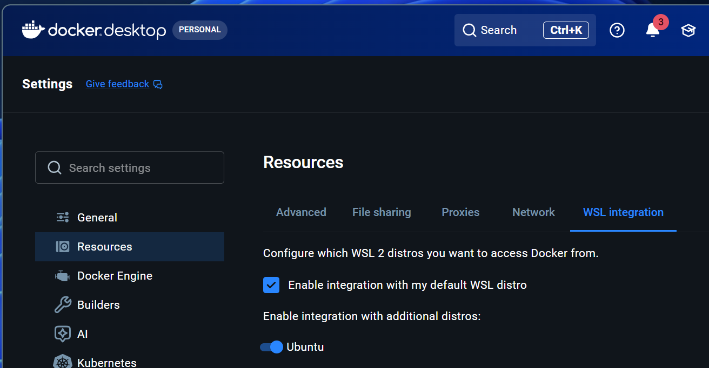

# Dev Container Prerequisites — Installation Guide

Everything you need to clone a Git repo and run it in a VS Code Dev Container, with command-line install steps for **Windows**, **macOS**, and **Ubuntu**. This is software you will need to install to work on code in this course.

## What gets installed

On every platform you end up with the same four things:

- **Git** — to clone the repo, commit your changes, and share to Github.
- **Visual Studio Code** — the integrated development environment: editor, debugger
- **Dev Containers extension** (`ms-vscode-remote.remote-containers`) — drives the container workflow. runs your code in isolation on your computer
- **A container runtime** — Docker Desktop (Windows/macOS) or Docker Engine (Ubuntu). This isolates the code.

### Installing

You can install the pre-requisites using a script or run the commands manually yourself.

1. If you want to use the script, see **Script Setup**
2. To type the command yourself, see **Manual Setup**

---

## Script Setup

If you don't want to run the commands manually, you can try these automated scripts. You will download code and it will attempt to setup automatically. 

**NOTE:** if they don't work try the manual setup.

**Windows** (Open PowerShell as Administrator):

```powershell
irm https://raw.githubusercontent.com/mafudge/ist356/refs/heads/main/0-intro/windows.ps1 | iex
```

> **Windows students: expect to run this more than once.** The script stops on purpose at two points it cannot get past on its own — after WSL 2 is installed it needs you to **reboot**, and after Docker Desktop starts it needs you to switch on **WSL integration** in Docker's settings. Each time, it tells you exactly what to do and asks you to run it again. Re-running is safe and fast; it skips everything already installed.

**macOS** (Open a Terminal):

```bash
curl -fsSL https://raw.githubusercontent.com/mafudge/ist356/refs/heads/main/0-intro/macos.sh | bash
```

**Ubuntu** (Open a Terminal):

```bash
curl -fsSL https://raw.githubusercontent.com/mafudge/ist356/refs/heads/main/0-intro/ubuntu.sh | bash
```

> **Safety note:** piping a remote script straight into a shell runs whatever the URL returns. Only do this with a source you control or trust, and prefer pinning to a specific commit/tag rather than `main` so the content can't change underneath you. If you'd rather inspect first, download and review before running:
>
> ```bash
> curl -fsSL https://raw.githubusercontent.com/mafudge/ist356/refs/heads/main/0-intro/ubuntu.sh -o ubuntu.sh
> less ubuntu.sh   # review
> chmod +x ubuntu.sh && ./ubuntu.sh
> ```
>
> **About the password prompt (macOS and Ubuntu):** these scripts will stop and ask for your computer's login password. **Nothing appears on screen as you type it** — no dots, no asterisks. That is normal, not a broken keyboard. Type your password and press ENTER. On macOS you also need to be an **administrator** on the Mac, because Docker Desktop can't install without admin rights. See [Troubleshooting (macOS)](#troubleshooting-macos) below if you get stuck on this.

---

## Manual Setup

### Windows

Run in **PowerShell as Administrator**. Windows 10/11 includes `winget`.

```powershell
# Enable WSL 2 and install the Ubuntu distro (sets WSL 2 as default)
wsl --install -d Ubuntu

# Git
winget install --id Git.Git -e

# Visual Studio Code
winget install --id Microsoft.VisualStudioCode -e

# Docker Desktop (uses the WSL 2 backend by default)
winget install --id Docker.DockerDesktop -e

# Dev Containers extension
code --install-extension ms-vscode-remote.remote-containers
```

**After installing:**

1. **Reboot.** Don't skip this — WSL 2 is not usable until the PC restarts, and Docker cannot start its engine until WSL 2 works.

2. **Run WSL once to finish setting it up.** 👈 *This is the step everyone misses.* `wsl --install -d Ubuntu` only **downloads** Ubuntu — the install isn't finished until you launch it one time. Open PowerShell and type:

   ```powershell
   wsl
   ```

   The first launch finishes installing Ubuntu and then asks you to **create a UNIX username and password**. That is a *new* account inside Ubuntu: it is **not** your Windows login and does not have to match it. Pick something short you'll remember. **Nothing appears on screen while you type the password** — no dots, no asterisks. That's normal, not a dead keyboard.

   When you land at a prompt that looks like `you@yourpc:~$`, Ubuntu is set up. Type `exit` to return to PowerShell.

3. **Verify WSL.** Back in PowerShell:

   ```powershell
   wsl -l -v
   ```

   You should see `Ubuntu` with `VERSION` **2**, and a `*` next to it marking it as your default distro. If the list is empty or Ubuntu is missing, install it explicitly and repeat step 2:

   ```powershell
   wsl --install -d Ubuntu
   ```

4. **Launch Docker Desktop** once so it completes WSL integration. The first time it opens it asks you to **accept a service agreement** — you must accept it, or the engine never starts. Wait until the bottom-left corner of its window says **Engine running**. Only then is Docker actually usable.

5. **Configure Docker to use WSL.** In Docker Desktop go to **Settings → Resources → WSL integration** and make sure both of these are set:

   - ✅ **Enable integration with my default WSL distro** is checked
   - Under **Enable integration with additional distros**, the **Ubuntu** toggle is switched **on**

   

   Then click **Apply & restart** and wait for **Engine running** to come back.

   > If **Ubuntu** does not appear in that list at all, you skipped step 2. The distro isn't set up yet, so Docker has nothing to integrate with. Go back, run `wsl`, create your UNIX username and password, then return here.

6. **Verify Docker and WSL are wired together.** In PowerShell:

   ```powershell
   wsl -e docker run hello-world
   ```

   This runs Docker *from inside Ubuntu*. If it prints the hello message, Windows, WSL 2, and Docker are all talking to each other. If you get `docker: command not found`, the integration in step 5 is not switched on.

7. Open a fresh terminal if `code` isn't recognized (PATH refresh).

> Requires virtualization enabled in BIOS/UEFI.

> ⚠️ If you skip steps 1–6, VS Code's **Reopen in Container** will spin forever and **never show an error message**. See [Troubleshooting (Windows)](#troubleshooting-windows) below.

---

### macOS

Run in **Terminal**. Uses [Homebrew](https://brew.sh).

```bash
# Install Homebrew if you don't have it
/bin/bash -c "$(curl -fsSL https://raw.githubusercontent.com/Homebrew/install/HEAD/install.sh)"

# Git
brew install git

# Visual Studio Code
brew install --cask visual-studio-code

# Docker Desktop
brew install --cask docker-desktop

# Dev Containers extension
code --install-extension ms-vscode-remote.remote-containers
```

> The Docker Desktop cask used to be called `docker`. It was renamed to `docker-desktop` — `brew install docker` on its own now installs only the command-line tool, without the Docker Desktop app you need for this course.

**After installing:**

1. Launch **Docker Desktop** once (`open -a Docker`) to start the daemon — Homebrew installs it but doesn't start it. It will ask for your password again so it can install its networking components; this is expected.
2. On Apple Silicon, the cask automatically pulls the correct ARM build.
3. You must be an **administrator** on this Mac. If you aren't, see [Troubleshooting (macOS)](#troubleshooting-macos).

---

### Ubuntu Linux

Run in **Terminal**. Installs Docker Engine natively (no Docker Desktop needed).

```bash
# Git
sudo apt update && sudo apt install -y git

# VS Code — add Microsoft's apt repo, then install
sudo apt install -y wget gpg apt-transport-https
wget -qO- https://packages.microsoft.com/keys/microsoft.asc | gpg --dearmor > packages.microsoft.gpg
sudo install -D -o root -g root -m 644 packages.microsoft.gpg /etc/apt/keyrings/packages.microsoft.gpg
echo "deb [arch=amd64,arm64,armhf signed-by=/etc/apt/keyrings/packages.microsoft.gpg] https://packages.microsoft.com/repos/code stable main" | sudo tee /etc/apt/sources.list.d/vscode.list
rm -f packages.microsoft.gpg
sudo apt update && sudo apt install -y code

# Docker Engine — via Docker's official convenience script
curl -fsSL https://get.docker.com | sudo sh

# Run Docker without sudo (log out / back in afterward)
sudo usermod -aG docker $USER

# Dev Containers extension
code --install-extension ms-vscode-remote.remote-containers
```

**After installing:**

1. **Log out and back in** (or run `newgrp docker`) so the `docker` group takes effect.

---

## Troubleshooting (macOS)

Almost every macOS setup problem in this course is one of these three. Find your symptom.

### "Terminal is asking for a password, but nothing happens when I type."

**It is working.** For security, the terminal shows *nothing at all* while you type a password — no dots, no asterisks, no moving cursor. It looks identical to a frozen screen or a dead keyboard.

**What to do:** Type your Mac login password anyway and press **ENTER**.

If you mistype it, you'll see `Sorry, try again.` and get two more attempts. After three, you'll see `3 incorrect password attempts` and the command quits — that isn't a lockout, just re-run the command and try again.

### "A window is asking me to log in as an administrator, and my password is rejected."

Read that window carefully. If it asks for **an administrator's name and password** (with a *username* box, not just a password box), macOS is telling you that **your account is not an administrator**. Your own password will be rejected every time, no matter how carefully you type it. This is not a typo and not a bug.

**Check whether you're an admin:** Open  → **System Settings** → **Users & Groups**. Find your account in the list. Underneath your name it says either **Administrator** or **Standard**.

**If it says Standard, pick one of these:**

1. **Get an administrator to authorize it.** If someone else set up this Mac, have them enter their name and password at the prompt, or run the install for you.
2. **Ask IT for admin rights.** If this is a school- or employer-managed Mac (it was handed to you already configured, or it force-installs software), your account was deliberately made Standard. You'll need to request administrator access from whoever manages it — for SU-managed machines that's [ITS](https://its.syr.edu/).
3. **Use GitHub Codespaces instead.** 👈 *This is the fastest unblock.* Codespaces runs the whole course environment in your browser with **nothing installed on your Mac and no admin rights required**. See **Step 1, option 2** in [Course Setup](0-0-setup.md). You can always come back and install locally later.

### "Docker Desktop keeps asking for my password when I launch it."

Expected. The first time Docker Desktop runs, it installs a privileged helper for its networking components, and macOS requires administrator approval for that. Enter your password and allow it.

If that prompt won't accept your password, you're in the previous case — your account is Standard, not Administrator.

---

## Troubleshooting (Windows)

### "Reopen in Container just spins forever. It never opens and never gives me an error."

This is the most common Windows problem in this course, and the silence is the clue: the Dev Containers extension is fine, and it is patiently waiting for a Docker engine that is never going to answer.

**Work through these in order:**

1. **Is Docker Desktop actually running?** Open it from the Start menu. Look at the **bottom-left corner** of its window — it must say **Engine running**. "Starting…" or "Stopped" means Docker isn't ready, and nothing container-related will work.
2. **Is it waiting on the service agreement?** The first time Docker Desktop launches it shows an agreement you have to accept. Until you click accept, the engine silently stays down.
3. **Did you reboot after WSL 2 was installed?** WSL 2 doesn't work until the PC restarts, and Docker's engine is built on it. If you haven't rebooted since running the install script, do it now.
4. **Did you run `wsl` once to finish setting it up?** Installing WSL is not the same as *finishing* WSL. Run:

   ```powershell
   wsl -l -v
   ```

   If nothing is listed, run `wsl --install -d Ubuntu`. If `Ubuntu` is listed but you were never asked to create a UNIX username and password, type `wsl`, complete the setup, then `exit`. See [step 2 of the Windows install](#windows) above.
5. **Is WSL integration turned on in Docker?** In Docker Desktop: **Settings → Resources → WSL integration** — **Enable integration with my default WSL distro** must be checked, *and* the **Ubuntu** toggle under **Enable integration with additional distros** must be on. Click **Apply & restart**. See [step 5 of the Windows install](#windows) above for a screenshot.

To confirm Docker is healthy before you touch VS Code, run this in a terminal:

```powershell
docker run hello-world
```

If that prints a hello message, Docker is fine. If it hangs or errors, fix that first — the dev container cannot work until it succeeds.

### "Docker Desktop's WSL integration list is empty — there's no Ubuntu to turn on."

Docker can only integrate with a distro that has actually finished installing. `wsl --install -d Ubuntu` downloads Ubuntu but leaves it half-built until the first launch, and a half-built distro does not show up in Docker's list.

**Fix.** In PowerShell:

```powershell
wsl
```

Complete the first-run setup (it asks you to create a UNIX username and password), type `exit`, then go back to **Settings → Resources → WSL integration** in Docker Desktop. **Ubuntu** will be there now. Switch it on and click **Apply & restart**.

If `wsl` reports that no distributions are installed, install one first:

```powershell
wsl --install -d Ubuntu
```

### "WSL is asking me to create a password, but nothing happens when I type."

**It is working.** Linux shows *nothing at all* while you type a password — no dots, no asterisks, no moving cursor. Type the password you want and press **ENTER**, then type it again to confirm.

Two things to know about this account:

- It is a **new** username and password that exists only inside Ubuntu. It is not your Windows login, your SU NetID, or your GitHub account.
- Write it down. You'll need the password any time you run a `sudo` command inside Ubuntu.

### "It looks frozen, but is it actually just downloading?"

Quite possibly. The first time you open the dev container, Docker downloads the course image — **about 1.3 GB**. VS Code shows this as a small spinner in the bottom-right corner, which looks exactly like a hang. On a slow or busy connection it can take 20 minutes or more.

**To see what's really happening:** click the bottom-right progress notification to open the log — you'll see the layers downloading.

**Better: download it up front**, in a terminal, where you get a real progress bar:

```powershell
docker pull mafudge/ist356:latest
```

Once that finishes, opening the dev container is quick, because the image is already on your machine.

### "winget is not recognized as the name of a cmdlet..."

`winget` is part of **App Installer**. Two things cause it to go missing, and the second is by far the more common one in this course:

**1. App Installer isn't installed.** It ships with Windows 11 and current Windows 10, but not with older builds. Open the **Microsoft Store**, search for **App Installer**, and install or update it. If this PC has no Store, get it from <https://aka.ms/getwinget>. Then open a **new** PowerShell window and check:

```powershell
winget --version
```

**2. You elevated PowerShell as a different account.** 👈 *Usually this one.* `winget` is installed **per user**. If the User Account Control prompt asked for an administrator's *username and password* and you typed someone else's, PowerShell is now running as that person — and `winget` doesn't exist for them, so it disappears from PATH.

This also means your account is **not** an administrator. See the next section, which has the fix — it's the same underlying problem.

### "I had to type a different admin account at the User Account Control prompt."

If the UAC prompt asked for a username *and* password and you entered somebody else's administrator account, then Windows installed VS Code and its extensions **for that account, not for you**. From your own login, VS Code will have no Dev Containers extension — so "Reopen in Container" won't be there at all.

**Check.** From your own login, in a terminal:

```powershell
code --list-extensions
```

`ms-vscode-remote.remote-containers` should appear in the list.

**Fix.** Install it as yourself: open VS Code, click the **Extensions** icon in the left sidebar, search for **Dev Containers**, and click **Install**. No admin rights are needed for this. If your account isn't an administrator at all, see the same three options in the [macOS section](#troubleshooting-macos) — they apply here too, including using **GitHub Codespaces** instead.

---

## Verify everything works

On any platform, confirm the Docker runtime works.

```bash
docker run hello-world
```

**On Windows**, also confirm WSL 2 finished setting up and that Docker is wired into it:

```powershell
wsl -l -v                      # Ubuntu should be listed, VERSION 2, marked * as default
wsl -e docker run hello-world  # runs Docker from inside Ubuntu
```

If the second command says `docker: command not found`, turn on **Settings → Resources → WSL integration** in Docker Desktop — see [step 5 of the Windows install](#windows).

After that you can continue with the [Course Setup](0-0-setup.md)
